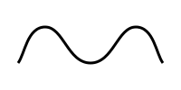
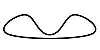

[ENGLISH](./README_EN.md)

<h1 align="center">Bezier Curve Extension</h1>

<p align="center">
    <a href="https://travis-ci.com/DataV-Team/beziercurve">
      
    </a>
    <a href="https://github.com/DataV-Team/beziercurve/blob/master/LICENSE">
      
    </a>
    <a href="https://www.npmjs.com/package/@jiaminghi/bezier-curve">
      
    </a>
</p>

### 这是一个提供如下几个方法的三次贝塞尔曲线插件。

- **[bezierCurveToPolyline](#bezierCurveToPolyline)**

  将贝塞尔曲线抽象成由 N 个点构成的折线

- **[getBezierCurveLength](#getBezierCurveLength)**

  获取贝塞尔曲线的长度

- **[polylineToBezierCurve](#polylineToBezierCurve)**

  将由 N 个点构成的折线抽象成光滑的贝塞尔曲线

### npm 安装

```shell
$ npm install @jiaminghi/bezier-curve
```

### 使用

```javascript
import bezierCurve from '@jiaminghi/bezier-curve'

// do something
```

### 快速体验

```html
<!--调试版-->
<script src="https://unpkg.com/@jiaminghi/color/dist/index.js"></script>
<!--压缩版-->
<script src="https://unpkg.com/@jiaminghi/color/dist/index.min.js"></script>
<script>
  const { bezierCurveToPolyline, getBezierCurveLength, polylineToBezierCurve } = window.BezierCurve
  // do something
</script>
```

---

<h3 align="center">示例</h3>

#### bezierCurve

```typescript
type Point = [number, number]

/**
 * [控制点1，控制点2，结束点]
 */
type BezierCurveSegment = [Point, Point, Point]

/**
 * [起始点, 贝塞尔曲线段, ...]
 * 下一段贝塞尔曲线的起始点是上一段的结束点
 */
type BezierCurve = [Point, BezierCurveSegment, ...BezierCurveSegment[]]

const bezierCurve: BezierCurve = [
  [20, 20],
  [
    [100, 20],
    [100, 80],
    [180, 80],
  ],
]
```

<p align="center">
    
</p>

<p align="center"><i>bezierCurve</i> in <b>SVG</b></p>

#### bezierCurveToPolyline

```typescript
/**
 * @description 将贝塞尔曲线转换为折线
 * @param {BezierCurve} bezierCurve 贝塞尔曲线
 * @param {number} precision        需要的计算精度
 * @param {number} recursiveCount   迭代次数
 * @return {Point[]} 转换的折线
 */
type bezierCurveToPolyline = (
  bezierCurve: BezierCurve,
  precision = 5,
  resursiveCount = 0
) => Point[]

const polyline = bezierCurveToPolyline(bezierCurve)
// polyline = [
// [[20,20],
// [25.998752507628243,20.11632023466343],[31.698106846035834,20.457189096242345],
// [37.11424670004552,21.010468821119716],[42.263355754480024,21.764021645678454],
// ...]
```

<p align="center">
    
</p>

<p align="center"><i>polyline</i> in <b>SVG</b></p>

#### Notice

- *bezierCurveToPolyline*的计算结果是由 N 个点构成的折线，N 取决于设置的精度。
- 理想情况下，计算结果中相邻的两个点的距离等于设置的精度（单位 px）。
- 建议精度 5-10。
- 设置的精度通常是达不到的，除非设置较高的迭代次数，计算成本较高。

#### getBezierCurveLength

```typescript
/**
 * @description 计算贝塞尔曲线的长度
 * @param {BezierCurve} bezierCurve 贝塞尔曲线
 * @param {number} precision        需要的计算精度
 * @param {number} recursiveCount   迭代次数
 * @return {number} 转换的折线
 */
type getBezierCurveLength = (bezierCurve: BezierCurve, precision = 5, resursiveCount = 0) => Point[]

// 通常情况下，默认精度已经能够达到较好的视觉效果。
const length = getBezierCurveLength(bezierCurve)
```

#### polyline

```typescript
const polyline: Point[] = [
  [20, 70],
  [50, 30],
  [100, 70],
  [150, 30],
  [180, 70],
]
```

<p align="center">
    
</p>

<p align="center"><i>polyline</i> in <b>SVG</b></p>

#### polylineToBezierCurve

```typescript
/**
 * @description 将折线转换为贝塞尔曲线
 * @param {Point[]} polyline 折线
 * @param {boolean} close    转换的贝塞尔曲线是否需要闭合
 * @param {number} offsetA   光滑程度
 * @param {number} offsetB   光滑程度
 * @return {BezierCurve} 转换的贝塞尔曲线
 */
type polylineToBezierCurve = (
  polyline: Point[],
  close = false,
  offsetA = 0.25,
  offsetB = 0.25
) => BezierCurve

const bezierCurve = polylineToBezierCurve(polyline)
// bezierCurve = [
// [
// 	[20,70],
// 	[[27.5,60],[30,30],[50,30]],
// 	[[70,30],[75,70],[100,70]],
// 	[[125,70],[130,30],[150,30]],
// 	[[170,30],[172.5,60],[180,70]]]
//]

const closedBezierCurve = polylineToBezierCurve(polyline, true)
// closedBezerCurve = [
// 	[20,70],
// 	[[-12.5,60],[30,30],[50,30]],
// 	[[70,30],[75,70],[100,70]],
// 	[[125,70],[130,30],[150,30]],
// 	[[170,30],[212.5,60],[180,70]],
// 	[[147.5,80],[52.5,80],[20,70]]
// ]
```

<p align="center">
    
</p>

<p align="center"><i>bezierCurve</i> in <b>SVG</b></p>

<p align="center">
    
</p>

<p align="center"><i>closedBezierCurve</i> in <b>SVG</b></p>
